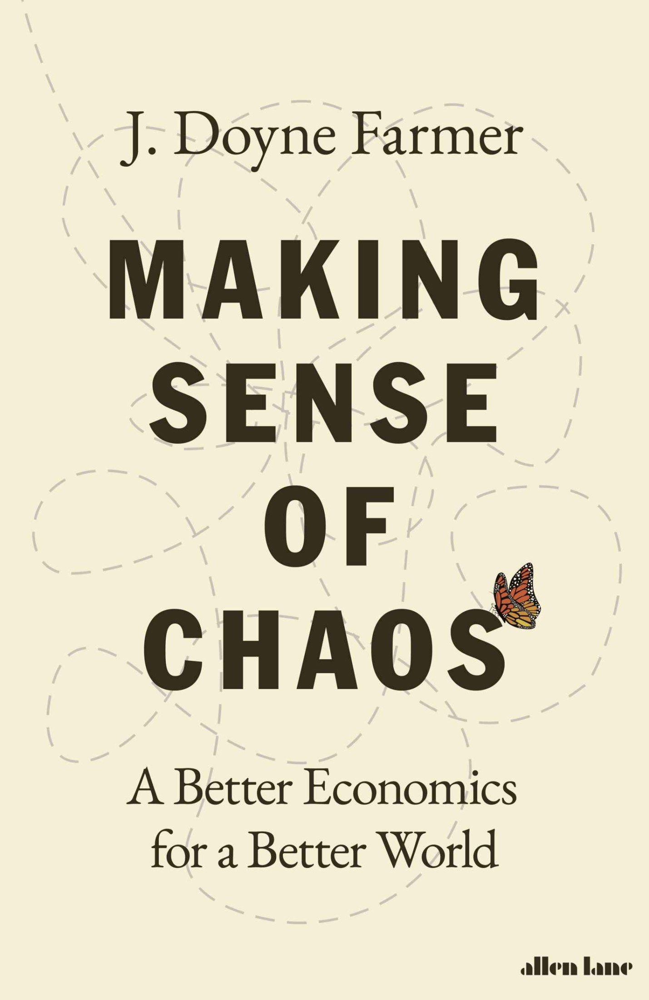
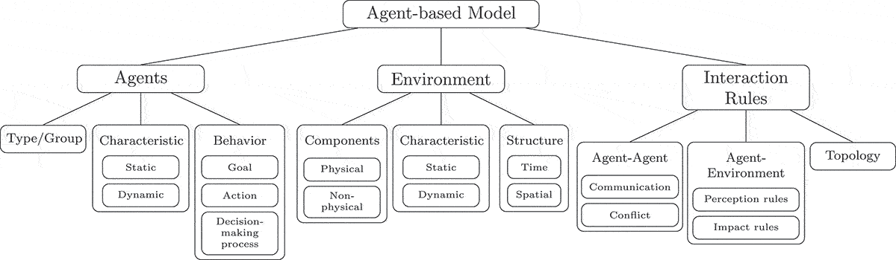



# Статьи и книги

1. [J.D. Farmer - Making Sense of Chaos. 
A Better Economics for a Better World](books/farmer1/index.html ':ignore')

2. Robert L. Axtell and J. Doyne Farmer - 
Agent-Based Modeling in Economics and Finance: 
Past, Present, and Future (2025) 
[PDF](books/Axtell_and_Farmer_2025_Agent_based_modeling.pdf ':ignore'),
[HTML](books/Axtell_and_Farmer_2025_Agent_based_modeling.html ':ignore')

3. J. Doyne Farmer - Quantitative agent-based models: 
a promising alternative for macroeconomics (2025) [PDF](books/Farmer-Quantitative-agent-based-models.pdf ':ignore'), 
[HTML](books/Farmer-Quantitative-agent-based-models.html ':ignore'), 
[Link](https://academic.oup.com/oxrep/article/41/2/571/8281854)

4. J. Doyne Farmer - The agent-based modeling approach to MFM (2012) [PDF](books/Farmer_2012.pdf ':ignore'), 
[HTML](books/Farmer_2012.html ':ignore')

5. Ron Wallace - Agents, Equations, and Economics (2021) [PDF](books/Wallace.pdf ':ignore'),
[HTML](books/Wallace.html ':ignore')
                                               

6. [R. Jamali - Agent-based modeling and simulation for economic markets: 
a comprehensive review of applications, challenges, and opportunities (2026)](books/abms/xhtml/index.html ':ignore')

7. Paul Krugman - How Did Economists Get It So Wrong? (2009) [PDF](books/Krugman_2009.pdf ':ignore'),
[HTML](books/Krugman_2009.html ':ignore')

8. Paul Krugman - Learned Helplessness (30.11.2010) [Link](https://archive.nytimes.com/krugman.blogs.nytimes.com/2010/11/30/learned-helplessness/):

Oh, and about ~Roger~ Doyne Farmer (sorry, Roger!) and Santa Fe and complexity and all that: 
I was one of the people who got all excited about the possibility of getting somewhere 
with very detailed agent-based models — but that was 20 years ago. 
And after all this time, it’s all still manifestos and promises of great things one of these days.

Ах да, и насчет ~Роджера~ Дойна Фармера (прости, Роджер!), Санта-Фе, сложности и всего такого: 
я был одним из тех, кто с воодушевлением воспринял возможность чего-то добиться с помощью 
очень детализированных агентных моделей, — но это было 20 лет назад. 
И спустя все это время все по-прежнему сводится к манифестам и обещаниям великих свершений.

